<!-- ═══════════════════════════════════════════════════════════════ -->
<!--              github.com/defnotwig/defnotwig                    -->
<!--              Gabriel Ludwig Rivera                             -->
<!--              Full-Stack AI Systems Engineer                    -->
<!-- ═══════════════════════════════════════════════════════════════ -->

<!-- ░░░░░░░░░░░░░░░░░░░  HERO BANNER  ░░░░░░░░░░░░░░░░░░░ -->

<div align="center">
  
</div>

<!-- ░░░░░░░░░░░░░░░░░░░  ROLES HEADER  ░░░░░░░░░░░░░░░░░░░ -->

<div align="center">
  <h2><code>[ FULL-STACK AI SYSTEMS ENGINEER ]</code></h2>
  <p><strong>Agentic Ops &bull; Governance &bull; Automation</strong></p>
</div>

<!-- ░░░░░░░░░░░░░░░░░░░  CONTACT BADGES  ░░░░░░░░░░░░░░░░░░░ -->

<div align="center">
  <a href="https://github.com/defnotwig"></a>
  &nbsp;
  
</div>

---

<!-- ░░░░░░░░░░░░░░░░░░░  AI MODEL PLAYGROUND  ░░░░░░░░░░░░░░░░░░░ -->

<div align="center">
  
</div>

---

<!-- ░░░░░░░░░░░░░░░░░░░  WHOAMI  ░░░░░░░░░░░░░░░░░░░ -->

## 🖥️ `whoami`

```txt
┌─────────────────────────────────────────────────────────────────┐
│                                                                 │
│  > Gabriel Ludwig Rivera                                        │
│  > Full-Stack AI Systems Engineer                               │
│  > Calamba, Laguna, Philippines                                 │
│                                                                 │
│  I build production-grade AI systems with governance            │
│  controls, audit trails, and multi-provider LLM                 │
│  orchestration. My systems run 24/7, self-heal,                 │
│  and never skip the guardrails.                                 │
│                                                                 │
│  ↳ Agentic ops that monitor, reason, and act safely             │
│  ↳ Full-stack: React → FastAPI → PostgreSQL → AWS               │
│  ↳ Every action logged, every decision auditable                │
│                                                                 │
└─────────────────────────────────────────────────────────────────┘
```

---

<!-- ░░░░░░░░░░░░░░░░░░░  BUILD IDENTITY  ░░░░░░░░░░░░░░░░░░░ -->

## 🧱 Build Identity

<table>
<tr>
<td align="center" width="33%">

### 🤖 Agentic Ops

Autonomous AI agents with cooldown controls, shift digests, self-healing sessions, and multi-provider fallback reasoning.

</td>
<td align="center" width="33%">

### 🛡️ Governance First

Read-only access, PII redaction, approval workflows, audit trails, and safety-gated actions by default.

</td>
<td align="center" width="33%">

### ⚡ Full-Stack Shipping

React + FastAPI + PostgreSQL + AWS EC2. From frontend to database to CI/CD pipeline to production.

</td>
</tr>
</table>

---

<!-- ░░░░░░░░░░░░░░░░░░░  AI MODEL ARCADE  ░░░░░░░░░░░░░░░░░░░ -->

## 🎮 AI Model Arcade

> `SELECT YOUR MODEL ▸`

<div align="center">
  
  
  
  
  
  
  
  
</div>

---

<!-- ░░░░░░░░░░░░░░░░░░░  PROJECTS  ░░░░░░░░░░░░░░░░░░░ -->

## ✦ Project Constellation

| Project | Description | Stack |
|---------|------------|-------|
| **OpenClaw Volare** | Read-first agentic ops assistant for Volare dialer monitoring. Lark integration, Hermes-Agent RCA, Paperclip governance, cooldown controls, self-healing watchdog, SQLite memory chronicle. | Ollama · Gemini · SQLite · Lark |
| **DLx** | Document generation + governance platform. Excel-driven generation, Word templates, attorney signature control, Lark approval workflows, RBAC, audit trails. | FastAPI · PostgreSQL · React · AWS EC2 |
| **K-WISE** | AI-assisted PC builder kiosk. 3,200+ compatibility rules, real-time validation, ML recommendations, JWT/RBAC auth, admin/kiosk workflows. | React · Node.js · PostgreSQL · Ollama |
| **FX Transparency Widget** | Embeddable stablecoin-to-fiat FX widget. Fallback rate providers, hot-cache, stale-threshold controls, AI-powered quote explanations. | TypeScript · React · Zod · Node.js |
| **SlopShield AI** | Static analysis + code review platform. Detects unsafe AI-generated code before production. Deterministic scanners, AI-assisted review, scoring rules. | Python · LLM APIs · Lark |
| **AJAIA Docs** | Collaborative document editor with rich-text editing, sharing, comments, version history, and AI assist. | Next.js · TipTap · SQLite · Vercel |

---

<!-- ░░░░░░░░░░░░░░░░░░░  TECH INVENTORY  ░░░░░░░░░░░░░░░░░░░ -->

## 🧰 Tech Inventory

**Frontend**

<div align="center">
  
  
  
  
  
  
  
  
</div>

**Backend**

<div align="center">
  
  
  
  
  
</div>

**DevOps & Tools**

<div align="center">
  
  
  
  
  
</div>

---

<!-- ░░░░░░░░░░░░░░░░░░░  HOW I BUILD  ░░░░░░░░░░░░░░░░░░░ -->

## ⚙️ How I Build

- **Understand** &mdash; Define the boundary of the problem.
- **Model** &mdash; Design schemas and APIs first.
- **Govern** &mdash; Embed security, logs, and guardrails.
- **Deploy** &mdash; Deliver safely via automated pipelines.
- **Monitor** &mdash; Track logs, auto-recover, and iterate.

---

<!-- ░░░░░░░░░░░░░░░░░░░  GITHUB SIGNAL  ░░░░░░░░░░░░░░░░░░░ -->

## 📊 GitHub Signal

<div align="center">
  
  &nbsp;&nbsp;
  
</div>

<br>

<div align="center">
  
</div>

<br>

<div align="center">
  
</div>

---

<!-- ░░░░░░░░░░░░░░░░░░░  CONTRIBUTION SNAKE  ░░░░░░░░░░░░░░░░░░░ -->

## 🐍 Contribution Snake

<div align="center">
  <picture>
    <source media="(prefers-color-scheme: dark)" srcset="https://raw.githubusercontent.com/defnotwig/defnotwig/output/github-contribution-grid-snake-dark.svg" />
    <source media="(prefers-color-scheme: light)" srcset="https://raw.githubusercontent.com/defnotwig/defnotwig/output/github-contribution-grid-snake.svg" />
    
  </picture>
</div>

---

<!-- ░░░░░░░░░░░░░░░░░░░  FOOTER  ░░░░░░░░░░░░░░░░░░░ -->

<div align="center">
  <sub>⚡ Built with governance. Deployed with confidence. Guardrails always on.</sub>
  <br>
  <sub>© 2026 Gabriel Ludwig Rivera</sub>
</div>
